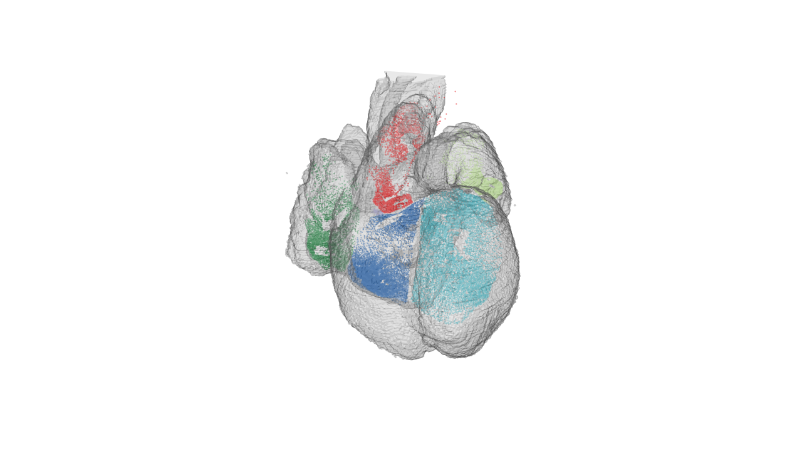

```{r setup, include=FALSE}
knitr::opts_chunk$set(echo = TRUE)
```

## Description of the data

Begin by loading some pre-processed data:
```{r}
load('./data/some_DAPI.RData')
```

In this case this is a segmentation data frame so lets check what variables are needed:

```{r}
head(segmentation)
```

We can test just to plot it first:
  
```{r}
plot(segmentation$x, segmentation$y, pch=16, cex=0.25, ylim=rev(range(segmentation$y)), asp=1)
```

Lets source the helper functions in R we need (they are located under the r folder in this Rproject)
```{r}
source('./r/helper_functions.R')
```

I downsampled the original image to 8255 x 9410 from the original 16510 x 18819 which is roughly 0.5.
So if your RCP centroids are in original pixel coordinates just downsample them `segmentation[,1:2] <- 0.5*segmentation[,1:2]`.

Other than that you are ready to just transform them to the atlas by this command:

```{r message=FALSE, results='hide',fig.keep='all', warning=FALSE}
#load in the sp and png package
if(!require("sp")){
  install.packages("sp")
  library("sp")
}
if(!require("png")){
  install.packages("png")
  library("png")
}
#load in the registration transformation
load('./data/ISS_regi6_5weeks.RData')
#get your dataset object
dataset<-rcp.to.atlas(regi, segmentation)
```

Lets check it out:
```{r}
head(dataset)
```
To get how many RCPs you have in agiven region check for example:
```{r}
table(dataset$acronym)
```

We can also plot this:

```{r}
par(mfrow=c(1,4), mar=c(0,0,0,0))
plot.regi(regi)
plot.regi(regi, draw.trans.grid = TRUE)
plot.regi(regi)
points(dataset$x, dataset$y, col = as.character(dataset$color), pch=16, cex=0.125)
#dataset$anterior.posterior<-rep(atlasIndex[which(atlasIndex[,2]==regi$coordinate), 1], length(dataset$right.left))
```

3D heart plot using RGL
-----------------------

RGL is a package that uses OpPenGL as backend for 3D visualization in R. misc3d is a package that we will use for drawing scenes in 3d.

``` r
library(rgl)
library(misc3d)
```

Load the 3D volume heart atlas.

``` r
load('./data/heart.RData')
```

We begin by defining the perspective we want to plot from (this doesn't have to make sense now I'll show later how to get these parameters):

``` r
perspective<-list(FOV = 30, ignoreExtent = FALSE, listeners = 1L, 
    mouseMode = structure(c("trackball", "zoom", "fov", "pull"
    ), .Names = c("left", "right", "middle", "wheel")), skipRedraw = FALSE, 
    userMatrix = structure(c(-0.0108720660209656, 0.899227440357208, 
    0.437346190214157, 0, 0.955604612827301, -0.119448974728584, 
    0.269354522228241, 0, 0.2944515645504, 0.420858442783356, 
    -0.858007192611694, 0, 0, 0, 0, 1), .Dim = c(4L, 4L)), scale = c(1, 
    1, 1), viewport = structure(c(0L, 0L, 1280L, 720L), .Names = c("x", 
    "y", "width", "height")), zoom = 1, windowRect = c(0L, 45L, 
    1280L, 765L), family = "sans", font = 1L, cex = 1, useFreeType = TRUE)
```

Lets plot the entire heart and then regions outlines.

``` r
#open 3D plot window
open3d(windowRect = c(0, 0, 1280, 720))
#use the perspective
par3d(perspective)
#draw high-resolution heart. If you want low resolution then change organ to organ.dwnsmp
drawScene.rgl(organ[which(names(organ.dwnsmp)%in%c('WH'))])
#add anterior posterio value from registration file
dataset$anterior.posterior<-rep(atlasIndex[which(atlasIndex[,2]==regi$coordinate), 1], length(dataset$right.left))
#draw the points
points3d(598-dataset$rostral.caudal, 
         532-dataset$right.left, 
         dataset$anterior.posterior, 
         alpha = 0.5, 
         size = 0.5, 
         color = "black")
#save image as PNG
rgl.snapshot(filename='./data/3d_heart_RCPs.png')
```




