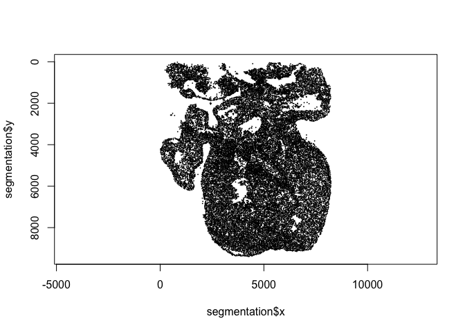
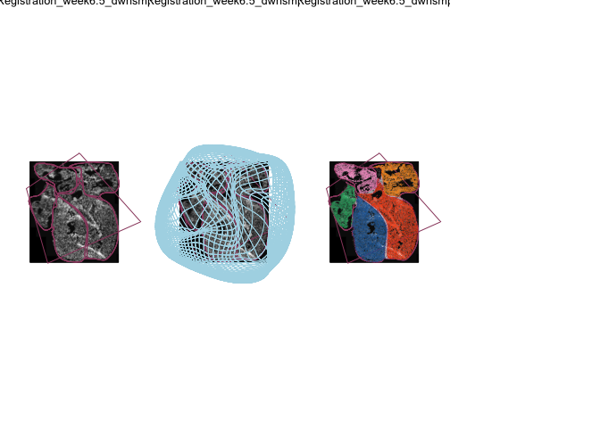

Getting RCPs into the atlas
================

Description of the data
-----------------------

Begin by loading some pre-processed data:

``` r
load('./data/some_DAPI.RData')
```

In this case this is a segmentation data frame so lets check what variables are needed:

``` r
head(segmentation)
```

    ##          x        y intensity area
    ## 1 4292.889 9385.777  2885.750    6
    ## 2 4262.615 9392.975  4528.455   52
    ## 3 4246.311 9373.688  4970.923   30
    ## 4 4201.455 9378.637  3419.029   88
    ## 5 4138.000 9371.394  2034.167   44
    ## 6 4076.000 9366.000  2969.250    4

We can test just to plot it first:

``` r
plot(segmentation$x, segmentation$y, pch=16, cex=0.25, ylim=rev(range(segmentation$y)), asp=1)
```



Lets source the helper functions in R we need (they are located under the r folder in this Rproject)

``` r
source('./r/helper_functions.R')
```

I downsampled the original image to 8255 x 9410 from the original 16510 x 18819 which is roughly 0.5. So if your RCP centroids are in original pixel coordinates just downsample them `segmentation[,1:2] <- 0.5*segmentation[,1:2]`.

Other than that you are ready to just transform them to the atlas by this command:

``` r
#load in the sp and png package
if(!require("sp")){
  install.packages("sp")
  library("sp")
}
if(!require("png")){
  install.packages("png")
  library("png")
}
#load in the registration transformation
load('./data/ISS_regi6_5weeks.RData')
#get your dataset object
dataset<-rcp.to.atlas(regi, segmentation)
```

Lets check it out:

``` r
head(dataset)
```

    ##          x        y intensity area id   color acronym right.left
    ## 1 4292.889 9385.777  2885.750    6 NA #000000    <NA>   169.7067
    ## 2 4262.615 9392.975  4528.455   52 NA #000000    <NA>   168.0779
    ## 3 4246.311 9373.688  4970.923   30 NA #000000    <NA>   168.4512
    ## 4 4201.455 9378.637  3419.029   88 NA #000000    <NA>   166.7068
    ## 5 4138.000 9371.394  2034.167   44 NA #000000    <NA>   165.2069
    ## 6 4076.000 9366.000  2969.250    4 NA #000000    <NA>   163.2070
    ##   rostral.caudal
    ## 1       476.3170
    ## 2       476.2965
    ## 3       474.9268
    ## 4       474.8169
    ## 5       473.3169
    ## 6       471.8168

To get how many RCPs you have in agiven region check for example:

``` r
table(dataset$acronym)
```

    ## 
    ##     A     P    RA    RV    WH 
    ##   270   978  2241  8141 12708

We can also plot this:

``` r
par(mfrow=c(1,3), mar=c(0,0,0,0))
plot.regi(regi)
plot.regi(regi, draw.trans.grid = TRUE)
plot.regi(regi)
points(dataset$x, dataset$y, col = as.character(dataset$color), pch=16, cex=0.125)
```


